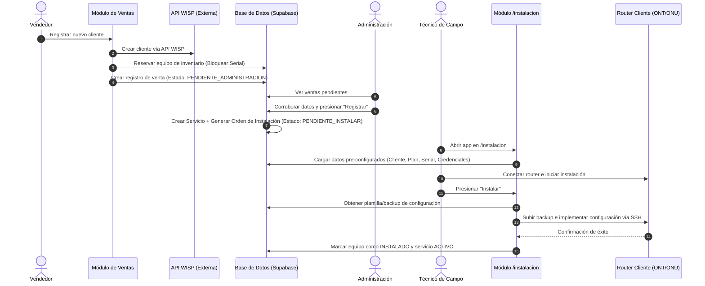

# Especificación Técnica: Flujo Automatizado de Ventas, Reserva de Inventario, Administración y Aprovisionamiento por SSH

Este documento especifica la arquitectura y el flujo de trabajo punta a punta para la integración de **Ventas**, **WISP API**, **Reserva de Inventario**, **Aprobación Administrativa** e **Instalación Técnica con Aprovisionamiento SSH**. 

---

## 🔄 Visión General del Flujo

---

## 📋 Detalle de Etapas del Flujo

### 1. Módulo de Ventas (Registro y Bloqueo de Serial)
1. El asesor de ventas completa el formulario de registro del nuevo cliente en el frontend.
2. **Integración WISP API:** La aplicación envía los datos del cliente al sistema WISP a través de su API REST para darlo de alta.
3. **Reserva de Inventario:** 
   - El sistema realiza una consulta a la tabla `equipos` filtrando por `estado = 'DISPONIBLE'`.
   - Asigna un equipo (Serial PON) a la venta.
   - Actualiza el estado del equipo en la base de datos a `'RESERVADO'` (o `'BLOQUEADO_VENTA'`) para evitar que otro vendedor o proceso use el mismo serial.
4. Se crea el registro de venta con estado `PENDIENTE_ADMINISTRACION` y el ID del equipo asignado.

---

### 2. Módulo de Administración (Verificación y Creación de Servicio)
1. El equipo de administración visualiza las ventas en espera.
2. El administrador verifica la información del cliente, plan de servicio seleccionado y el serial bloqueado.
3. Al presionar **"Registrar / Aprobar"**:
   - El estado de la venta cambia a `APROBADA`.
   - Se crea automáticamente el **Servicio del Cliente** en la tabla `instalaciones` / `equipos_cliente`.
   - Se asocian las credenciales necesarias (PPPoE, claves Wi-Fi 2.4G/5G, credenciales administrativas del router).
   - La orden de instalación pasa a estar lista para el técnico con estado `PENDIENTE_INSTALAR`.

---

### 3. Módulo Técnico (/instalacion) y Carga de Backup por SSH
1. El técnico de campo llega al domicilio del cliente y abre la aplicación en la vista `/instalacion`.
2. La vista muestra automáticamente la información pre-cargada:
   - Datos del cliente y dirección.
   - Serial del equipo asignado (bloqueado previamente).
   - Plan de velocidad y credenciales PPPoE / Wi-Fi.
3. El técnico conecta el router físicamente a la red/equipo de prueba.
4. Al presionar **"Instalar"**:
   - El sistema busca la plantilla de configuración/backup adecuada en nuestra base de datos según el modelo y plan.
   - El backend establece una conexión **SSH** con la dirección IP/puerto por defecto del router cliente.
   - Se ejecuta el script de restauración/configuración que sube el backup y aplica los parámetros (PPPoE, Wi-Fi, VLAN, etc.).
5. Una vez terminada la carga SSH con éxito:
   - El equipo se marca como `'INSTALADO'` en la tabla `equipos`.
   - La instalación se marca como `'COMPLETADA'` / `'ACTIVA'`.

---

## ❓ Preguntas de Clarificación Técnica

Para dejar la implementación 100% afinada en el código, por favor responde a las siguientes preguntas:

1. **API de WISP:**
   - ¿Qué software WISP utilizan? (por ejemplo: *Wispro, WispHub, Mikrowisp, Splynx, o un sistema personalizado*).
   - ¿Tienen ya los endpoints, API Key o credenciales de autenticación para esta integración?

2. **Carga de Backup vía SSH a los Routers:**
   - ¿Qué marca y modelo de routers utilizan principalmente? (por ejemplo: *VSOL, Mikrotik, Huawei, ZTE, TP-Link*).
   - ¿Los routers se configuran por SSH usando comandos de consola (ej. scripts CLI) o subiendo un archivo de respaldo `.backup` / `.xml` / `.conf` vía SCP/SFTP?
   - ¿Cuál es la IP por defecto, usuario y clave SSH inicial que traen los routers de fábrica para conectarse?

3. **Reserva de Equipos:**
   - ¿El vendedor elige manualmente qué serial de equipo reservar de una lista de disponibles, o el sistema debe asignar automáticamente el primer serial disponible del inventario?

---
*Este documento sirva de guía compartida para el desarrollo en Antigravity y coordinación del repositorio.*
